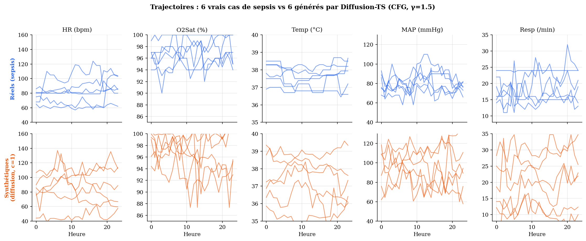
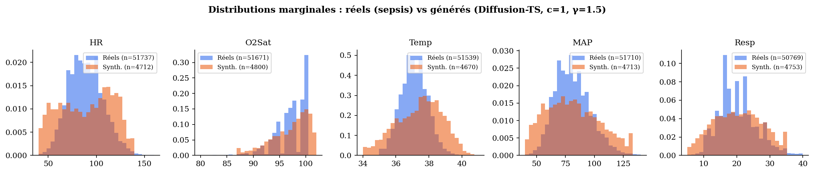

# Diffusion-TS Sepsis — Semi-Supervised Clinical Time Series Classification

Adaptation de [Diffusion-TS](https://github.com/Y-debug-sys/Diffusion-TS) (ICLR 2024) pour la **prédiction précoce du sepsis** sur le dataset PhysioNet/CinC Challenge 2019.

## Comment ça marche

L'objectif est de faire un **classifieur** de sepsis robuste malgré le faible nombre de patients labellés (~2.3 % du dataset). On chaîne **deux modèles distincts** :

1. Un **modèle de diffusion** (Diffusion-TS) qui *génère* des trajectoires patients synthétiques étiquetées sepsis. Il est entraîné sur l'intégralité du dataset (labellé + non labellé) et exploite *Classifier-Free Guidance* pour conditionner sur la classe.
2. Un **classifieur Transformer** qui *prédit* le sepsis sur les données réelles, augmentées par les synthétiques précédentes. Il intègre MC Dropout pour produire un score d'incertitude par échantillon.

```
Données brutes (40 336 patients)
        ↓  prétraitement (fenêtres 24h)
125 988 fenêtres  |  2.29 % positifs
        ↓  Diffusion-TS (semi-supervisé, 100 epochs)
   ↙                            ↘
Génération conditionnelle      Représentation apprise
(6 471 synth. sepsis)          des trajectoires patients
   ↘                            ↙
Classifieur Transformer + MC Dropout (N=50)
        ↓
Prédiction + Score d'incertitude
```

### Trois contributions

- **Génération conditionnelle par diffusion** — trajectoires synthétiques de sepsis (CFG, γ=1.5) qui rééquilibrent un dataset très déséquilibré
- **Cadre semi-supervisé** — la diffusion apprend sur 100 % des patients ; seul le guidage utilise les 10 % labellés
- **Incertitude bayésienne via MC Dropout** — variance ×12.8 plus élevée sur les erreurs : le modèle sait quand il hésite

---

## À quoi ressemblent les trajectoires générées ?

Pour valider que la diffusion produit du cliniquement plausible, on compare des cas **réels** vs **synthétiques** sur 5 signes vitaux.



> Les amplitudes physiologiques (HR 50–130, Temp 35–41, MAP 50–130, Resp 10–35) sont reproduites. Les variations sont lentes et continues, sans plateaux artificiels. Les synthétiques sont parfois légèrement plus larges en amplitude — effet attendu du coefficient de guidance γ=1.5 qui accentue le caractère pathologique.

Et la distribution marginale des 200 échantillons synthétiques recouvre largement celle des ~52 000 pas de temps réels :



---

## Résultats (test set, 10% de labels)

| Méthode | Type | AUROC | AUPRC | F1 | Util | ECE |
|---|---|---|---|---|---|---|
| XGBoost (labellé seulement) | Supervisé | 0.7835 | 0.0997 | 0.1156 | −0.468 | 0.020 |
| BiLSTM (labellé seulement) | Supervisé | 0.8410 | 0.1086 | 0.1252 | −0.165 | 0.029 |
| Transformer (sans augmentation) | Diffusion (sans semi-sup.) | 0.7892 | 0.0801 | 0.1092 | −0.472 | 0.016 |
| TimeGAN (semi-sup.) | GAN-based | 0.8363 | 0.0993 | 0.1269 | −0.229 | 0.014 |
| Path Signatures + XGBoost† | Challenge winner | 0.7962 | 0.1009 | 0.1085 | — | — |
| **Diffusion-TS + Aug + MC Dropout ★** | **Ours (semi-sup.)** | **0.8679** | **0.1363** | 0.1139 | **−0.080** | **0.009** |

† Morrill et al. (2020) — 1er PhysioNet/CinC 2019

- Seuil calibré par l'indice de Youden sur la validation (seuil optimal = 0.018)
- Score d'utilité PhysioNet : −0.080 (vs −1.97 avec seuil naïf à 0.5)
- Variance MC Dropout : ×12.8 plus élevée sur les erreurs (au seuil opérationnel) → incertitude corrélée aux erreurs (Pearson r = 0.43)

### Exemple concret (4 cas du test set)

Pour chaque cas : plage des signes vitaux observés sur la fenêtre 24h, puis sortie du modèle.

| Cas | HR (bpm) | Temp (°C) | MAP (mmHg) | Lactate | `y_true` | **P(sepsis)** | Var MC ×10⁻³ | Décision |
|---|---|---|---|---|---|---|---|---|
| TP confiant | 79–100 | 37.1–38.0 | 67–109 | non mesuré | sepsis | 0.419 | 1.07 | SEPSIS ✓ |
| TN confiant | 52–100 | 36.1–36.7 | 73–96 | non mesuré | sain | 0.002 | 0.001 | non-sepsis ✓ |
| **FP incertain** | 86–**135** | 36.6–37.7 | 92→**69** | non mesuré | sain | 0.728 | **19.5** | SEPSIS ✗ |
| FN | 62–86 | **35.0**–36.6 | 80–148 | 0.9–1.3 | sepsis | 0.013 | 0.12 | non-sepsis ✗ |

> Le **FP incertain** illustre la valeur clinique de MC Dropout : le modèle se trompe (le patient n'est pas septique) **mais sa variance est ×20 supérieure** à celle d'un TP confiant. Un système d'alerte intégrant l'incertitude pourrait signaler ce cas pour vérification humaine plutôt que déclencher une alarme automatique. À l'inverse, le **FN** est un échec silencieux : le modèle rate le sepsis ET ne le signale pas (variance basse) — typiquement un sepsis débutant masqué par une hypothermie atypique.

### Ablation : ratio de labels

| Ratio | Labels (+) | AUROC | AUPRC | F1 | ECE |
|---|---|---|---|---|---|
| 5% | 108 | 0.8642 | 0.1443 | 0.1410 | 0.0170 |
| 10% | 215 | 0.8679 | 0.1363 | 0.1139 | 0.0088 |
| 25% | 539 | 0.8669 | **0.1484** | 0.1153 | 0.0179 |
| **50%** | **1078** | **0.8684** | 0.1356 | 0.1228 | **0.0058** |

> L'AUROC varie de seulement **0.004 points** sur toute la plage 5–50% : la représentation apprise par diffusion sur les données non-labellées est suffisante, le guidage conditionnel est secondaire.

---

## Dataset

**PhysioNet/CinC Challenge 2019** — disponible sur [Kaggle](https://www.kaggle.com/datasets/salikhussaini49/prediction-of-sepsis)

Placer les données dans `data/raw/sepsis/` :
```
data/raw/sepsis/
├── training_setA/training/*.psv   (20 336 patients)
└── training_setB/training_setB/  (20 000 patients)
```

---

## Installation

```bash
# Cloner le repo
git clone https://github.com/BigYellowData/diffusion-ts-sepsis.git
cd diffusion-ts-sepsis

# Installer les dépendances avec uv
uv sync

# Vérifier le GPU
uv run python -c "import torch; print(torch.cuda.get_device_name(0))"
```

> PyTorch est installé avec support CUDA 12.8. Pour CPU uniquement, retirer les lignes `[[tool.uv.index]]` du `pyproject.toml`.

---

## Utilisation

### Pipeline complet (re-entraînement de zéro)

```bash
# Tout en une commande — preprocessing → diffusion → classifieur → évaluation → comparaison → figures
uv run python main.py --stage all

# Avec config personnalisée
uv run python main.py --stage all --config configs/config.yaml
```

### Étapes individuelles

```bash
uv run python main.py --stage preprocess   # ~4 min — fenêtrage 24h, masque, splits patient-level
uv run python main.py --stage diffusion    # ~25 min — Diffusion-TS, 100 epochs, RTX 4060 Ti
uv run python main.py --stage classifier   # ~15 min — Transformer + MC Dropout, early stopping
uv run python main.py --stage evaluate     # ~1 min — 50 passes MC Dropout sur le test
uv run python main.py --stage compare      # ~15 min — entraîne et compare 5 baselines
uv run python main.py --stage plots        # ~10 sec — génère ROC, PR, calibration, uncertainty_dist
```

### Étude d'ablation : variation du ratio de labels

```bash
uv run python main.py --stage all --label_ratio 0.05   # 5%  de labels (108 positifs)
uv run python main.py --stage all --label_ratio 0.10   # 10% de labels (215 positifs) — config par défaut
uv run python main.py --stage all --label_ratio 0.25   # 25% de labels (539 positifs)
uv run python main.py --stage all --label_ratio 0.50   # 50% de labels (1078 positifs)
```

### Notebook de démonstration

```bash
uv run jupyter lab notebooks/demo.ipynb           # ouvre le notebook en mode interactif
uv run jupyter nbconvert --to notebook --execute \
       notebooks/demo.ipynb --inplace             # ré-exécute toutes les cellules
```

Le notebook illustre cellule par cellule : chargement du dataset, génération de trajectoires synthétiques, prédiction MC Dropout sur 4 cas représentatifs (TP, TN, FP incertain, FN), métriques globales. **Sorties pré-peuplées** dans le fichier — lisible sans exécution.

> **Pré-requis pour ré-exécuter** :
> - Checkpoints `_best.pt` → ✅ inclus dans le repo (~4 MB)
> - Résultats `results/*.npy` + `metrics.json` → ✅ inclus
> - `data/processed/splits.npz` (924 MB) → non versionné. Lancer `--stage preprocess` au préalable si on veut voir les cellules de visualisation patient.

### Tests

```bash
uv run pytest                # 76 tests, ~1 seconde
uv run pytest -v             # mode verbose
uv run pytest tests/test_metrics.py   # un fichier spécifique
```

### Compilation du rapport LaTeX (optionnelle)

```bash
latexmk -pdf rapport.tex     # 2 passes pour résoudre les citations
```

> Le `rapport.pdf` compilé est versionné, recompilation utile uniquement si tu modifies `rapport.tex`.

---

## Architecture du projet

```
diffusion-ts-sepsis/
├── main.py                          # CLI principal : --stage {preprocess,diffusion,classifier,
│                                    #                         evaluate,compare,plots,all}
│                                    #                 [--config CONFIG] [--label_ratio FLOAT]
├── configs/
│   └── config.yaml                  # Tous les hyperparamètres (diffusion, classifieur, semi-sup)
│
├── src/
│   ├── data/
│   │   ├── preprocess.py            # Chargement parallèle PSV, fenêtrage 24h, masque NaN, splits
│   │   └── dataset.py               # PyTorch Dataset + DataLoaders avec labelled_mask
│   ├── models/
│   │   ├── denoiser.py              # Transformer débruiteur ε_θ (décomposition trend/seasonal, dropout p=0.1)
│   │   ├── diffusion_ts.py          # DDPM complet : cosine schedule, DDIM, CFG, generate_class()
│   │   └── classifier.py            # Transformer + [CLS] token + MC Dropout (50 passes)
│   ├── training/
│   │   ├── train_diffusion.py       # Boucle semi-sup. : labellés get cond=0/1, autres get UNCOND
│   │   └── train_classifier.py      # Génère 6471 synth. → augmente le train → class-balanced loss
│   ├── baselines/
│   │   ├── xgboost_baseline.py      # Features agrégées + XGBoost
│   │   ├── lstm_baseline.py         # BiLSTM supervisé
│   │   ├── diffusion_vanilla.py     # Transformer sans augmentation (mesure du gain de la diffusion)
│   │   ├── timegan_baseline.py      # TimeGAN semi-supervisé (Yoon et al. NeurIPS 2019)
│   │   ├── signature_baseline.py    # Path Signatures + XGBoost (Morrill et al. CinC 2019)
│   │   └── compare.py               # Entraîne + compare les 5 baselines, génère le tableau
│   └── utils/
│       ├── metrics.py               # AUROC, AUPRC, F1, ECE, PhysioNet utility
│       ├── uncertainty.py           # Évaluation MC Dropout, corrélation incertitude–erreur
│       └── plots.py                 # Figures ROC, PR, calibration, uncertainty_dist
│
├── tests/                           # 76 tests pytest (~1 sec)
│   ├── conftest.py
│   ├── test_dataset.py
│   ├── test_metrics.py
│   ├── test_models.py
│   ├── test_preprocess.py
│   └── test_uncertainty.py
│
├── notebooks/
│   └── demo.ipynb                   # Démonstration interactive (sorties peuplées)
│
├── checkpoints/                     # Modèles pré-entraînés (versionnés sélectivement)
│   ├── diffusion_best.pt            # ✅ inclus, utilisé pour la génération
│   └── classifier_best.pt           # ✅ inclus, utilisé pour la prédiction
│
├── results/                         # Sorties d'évaluation (versionnées)
│   ├── y_true.npy / mean_prob.npy / uncertainty.npy
│   └── metrics.json                 # AUROC, AUPRC, F1, ECE, Util, etc.
│
├── figures/                         # Figures du rapport (PDF + PNG)
│   ├── roc_curve.pdf, pr_curve.pdf
│   ├── calibration.pdf, uncertainty_dist.pdf
│   ├── synthetic_vs_real.{pdf,png}            # 6 trajectoires réelles vs 6 synthétiques
│   └── distribution_real_vs_synth.{pdf,png}   # Histogrammes marginaux
│
├── rapport.tex / rapport.pdf        # Rapport LaTeX 14 pages (CY Tech, ING 3, GenAI)
├── pyproject.toml / uv.lock         # Dépendances gérées par uv
├── pytest.ini                       # Config pytest
├── CY_Tech_logo.jpg                 # Logo pour la page de titre
├── .gitignore                       # data/processed/ et checkpoints/_final exclus
└── README.md                        # Ce fichier
```

---

## Références

- Yuan & Qiao (2024). *Diffusion-TS: Interpretable Diffusion for General Time Series Generation*. ICLR 2024.
- Reyna et al. (2020). *Early Prediction of Sepsis from Clinical Data: The PhysioNet/CinC Challenge 2019*. Critical Care Medicine.
- Gal & Ghahramani (2016). *Dropout as a Bayesian Approximation*. ICML 2016.
- Nichol & Dhariwal (2021). *Improved Denoising Diffusion Probabilistic Models*. ICML 2021.
- Yoon et al. (2019). *Time-series Generative Adversarial Networks*. NeurIPS 2019.
- Morrill et al. (2020). *The Signature-Based Model for Early Detection of Sepsis from Electronic Health Records in the Intensive Care Unit*. PhysioNet/CinC Challenge 2019.
